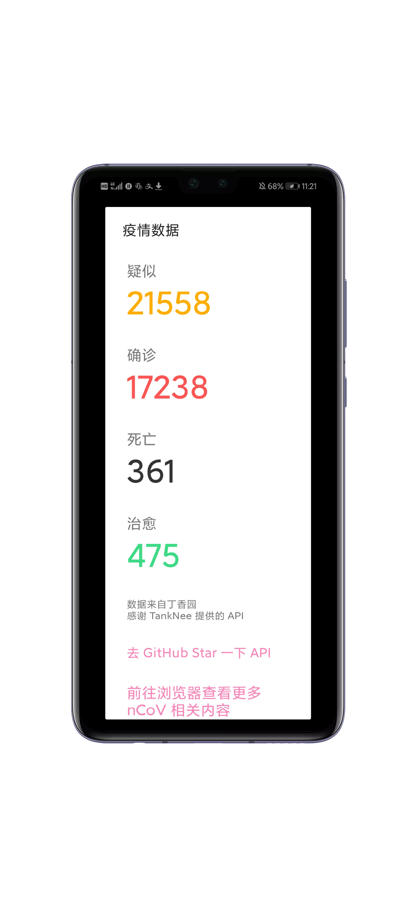

# nCoV-2019 疫情数据显示 - 基于 AndroLua 实现

通过一个小弹窗显示目前疫情的数据。

这个实例只能显示全国的数据，更多数据建议使用浏览器查看。

感谢 [TankNee 提供的 API](https://github.com/TankNee/nCoV-2019-DataAPI)。

## Usage

在项目里植入？去看看 [main.lua](./main.lua)。

作为独立的 app 运行？去看看 [main-original.lua](./main-original.lua)。

下载实例？[前往 Releases 页](https://github.com/imgradeone/nCoV-2019-DataShow-for-AndroLua/releases)。

## Screenshots

## Hint

由于 API 是每 20 分钟抓取一次数据，所以数据可能不及时。
